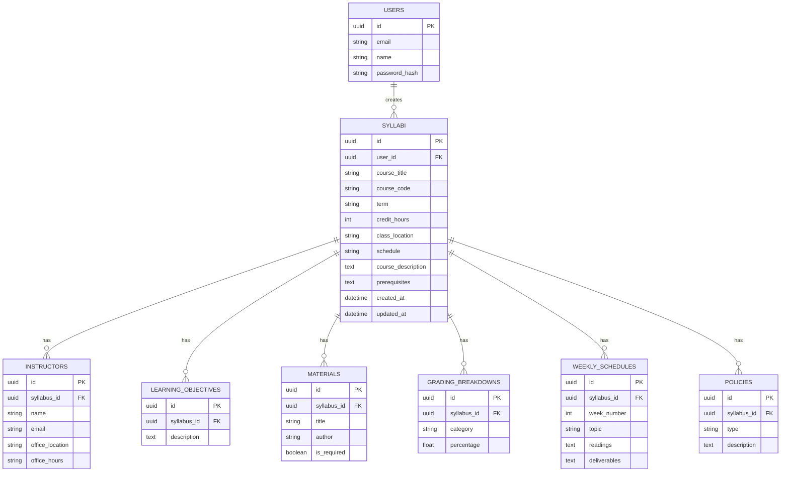

# Database Schema: Syllabus Management System

This document outlines the database schema for the Syllabus Management System using Drizzle ORM and MySQL.

## Entity-Relationship (ER) Diagram

```mermaid
erDiagram
    USERS {
        uuid id PK
        string email
        string name
        string password_hash
    }
    SYLLABI {
        uuid id PK
        uuid user_id FK
        string course_title
        string course_code
        string term
        int credit_hours
        string class_location
        string schedule
        text course_description
        text prerequisites
        datetime created_at
        datetime updated_at
    }
    INSTRUCTORS {
        uuid id PK
        uuid syllabus_id FK
        string name
        string email
        string office_location
        string office_hours
    }
    LEARNING_OBJECTIVES {
        uuid id PK
        uuid syllabus_id FK
        text description
    }
    MATERIALS {
        uuid id PK
        uuid syllabus_id FK
        string title
        string author
        boolean is_required
    }
    GRADING_BREAKDOWNS {
        uuid id PK
        uuid syllabus_id FK
        string category
        float percentage
    }
    WEEKLY_SCHEDULES {
        uuid id PK
        uuid syllabus_id FK
        int week_number
        string topic
        text readings
        text deliverables
    }
    POLICIES {
        uuid id PK
        uuid syllabus_id FK
        string type
        text description
    }

    USERS ||--o{ SYLLABI : "creates"
    SYLLABI ||--o{ INSTRUCTORS : "has"
    SYLLABI ||--o{ LEARNING_OBJECTIVES : "has"
    SYLLABI ||--o{ MATERIALS : "has"
    SYLLABI ||--o{ GRADING_BREAKDOWNS : "has"
    SYLLABI ||--o{ WEEKLY_SCHEDULES : "has"
    SYLLABI ||--o{ POLICIES : "has"
```
