# Activity Diagram: Create Syllabus

```mermaid
flowchart TD
    Start([Teacher logged in]) --> ClickCreate[Click 'Create New Syllabus']
    ClickCreate --> ShowForm[Show multi-section form\nwith progress stepper]
    
    ShowForm --> SectionA[Section A: Course Information]
    SectionA --> FillA[Fill: Title, Code, Term,\nCredit Hours, Location, Schedule]
    FillA --> SaveA[Auto-save draft]
    
    SaveA --> SectionB[Section B: Instructor Information]
    SectionB --> FillB[Fill: Name, Email,\nOffice, Office Hours]
    FillB --> SaveB[Auto-save draft]
    
    SaveB --> SectionC[Section C: Course Details]
    SectionC --> FillC[Fill: Description, Prerequisites,\nLearning Objectives, Materials]
    FillC --> AddObjective{Add more\nlearning objectives?}
    AddObjective -->|Yes| FillC
    AddObjective -->|No| SaveC[Auto-save draft]
    
    SaveC --> SectionD[Section D: Grading & Assessment]
    SectionD --> FillD[Fill: Grading breakdown\ntable + Grading scale]
    FillD --> AddGrade{Add more\ngrade items?}
    AddGrade -->|Yes| FillD
    AddGrade -->|No| SaveD[Auto-save draft]
    
    SaveD --> SectionE[Section E: Course Schedule]
    SectionE --> FillE[Fill: Week number, Topic,\nReadings, Deliverables]
    FillE --> AddWeek{Add more\nweeks?}
    AddWeek -->|Yes| FillE
    AddWeek -->|No| SaveE[Auto-save draft]
    
    SaveE --> SectionF[Section F: Course Policies]
    SectionF --> FillF[Fill: Attendance, Integrity,\nLate Work, Accommodations]
    FillF --> SaveF[Auto-save draft]
    
    SaveF --> AllFilled{All sections\ncompleted?}
    AllFilled -->|No| ShowErrors[Highlight incomplete\nsections]
    ShowErrors --> SectionA
    
    AllFilled -->|Yes| ShowPreview[Toggle to Live Preview\nor continue editing]
    
    ShowPreview --> UserAction{User chooses}
    UserAction -->|Edit more| SectionA
    UserAction -->|Export| ExportFlow[Export to Markdown\nSee: export-syllabus.md]
    UserAction -->|Save & Exit| MarkComplete[Mark syllabus as\n'Completed']
    
    MarkComplete --> Dashboard[Return to dashboard]
    ExportFlow --> Dashboard
    
    Dashboard --> End([End])
```

## Notes

- The form uses a **progress stepper** (7 steps) at the top, following the design system in `docs/ui/DESIGN.md`
- **Auto-save** happens on each section transition (Server Action with debounced auto-save)
- Sections A–F map directly to the PRD section 4.1
- Dynamic lists (learning objectives, grading items, weekly schedule) allow add/remove
- User can toggle between **Edit mode** and **Live Preview** at any time after section A
- Syllabus status transitions: `draft` → `completed`