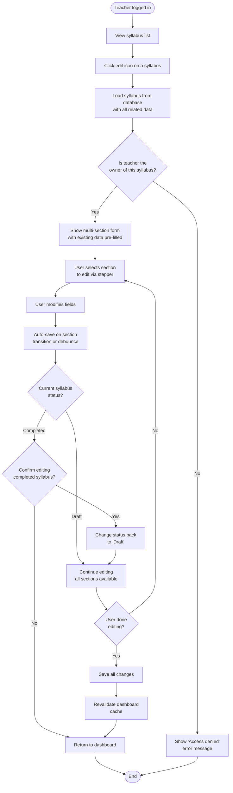

# Activity Diagram: Edit Syllabus

## Notes

- Only the syllabus owner can edit (enforced by `auth()` session check in Server Action)
- Editing a "Completed" syllabus changes its status back to "Draft"
- Auto-save uses the same Server Action as create — `updateSyllabus()`
- All child records (instructors, objectives, materials, etc.) are loaded and editable
- Changes to dynamic lists (add/remove weeks, objectives) are saved per-item