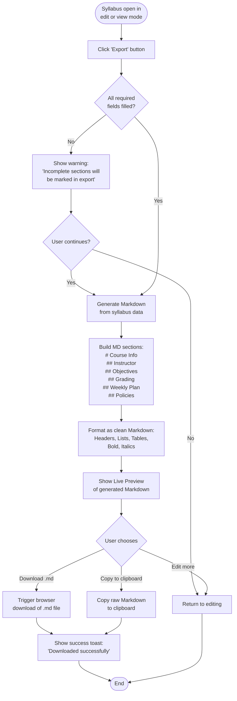

# Activity Diagram: Export Syllabus

## Notes

- Export is available from both **Edit mode** and **View mode**
- The Markdown file is named: `{course_code}_{term}.md` (e.g., `IT601201_2567-1.md`)
- Incomplete sections are included but marked with `> ⚠️ This section is incomplete`
- Grading breakdown is rendered as a Markdown table
- Weekly schedule is rendered as a Markdown table
- The "Copy to Clipboard" option uses the browser's Clipboard API
- No server-side file storage — the .md file is generated client-side and downloaded directly