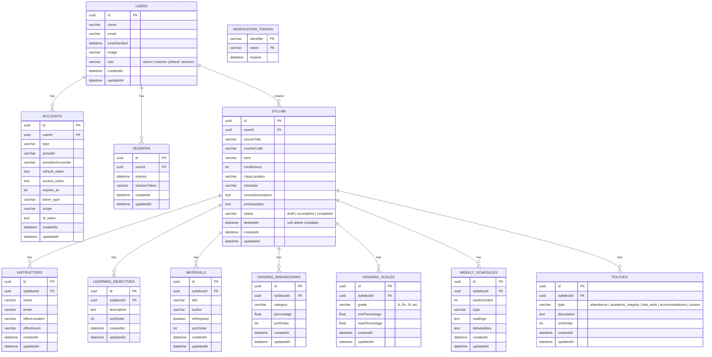

# Entity-Relationship (ER) Diagram

> This diagram includes Auth.js tables (users, accounts, sessions) plus all syllabus system tables.
> For detailed field definitions, see [`docs/database_schema.md`](../database_schema.md).

## Changes from Original Schema

| Change | Reason |
|--------|--------|
| Added `ACCOUNTS`, `SESSIONS`, `VERIFICATION_TOKENS` tables | Required by Auth.js v5 Drizzle adapter |
| Added `role` to `USERS` | Support admin vs teacher access levels |
| Added `emailVerified`, `image` to `USERS` | Required by Auth.js user model |
| Added `status` to `SYLLABI` | Track draft/incomplete/completed (matches UI) |
| Added `deletedAt` to `SYLLABI` | Soft delete for academic audit trail |
| Added `GRADING_SCALES` table | PRD mentions grading scale (A = 90-100%) but original schema had no table |
| Added `sortOrder` to child tables | Maintain user-defined ordering for dynamic lists |
| Added `createdAt` + `updatedAt` to ALL tables | Audit trail and debugging |
| Changed `POLICIES.type` to enum | Enforce standard policy types |
| All PKs are UUID (not serial/auto-increment) | Security, non-enumerable IDs |