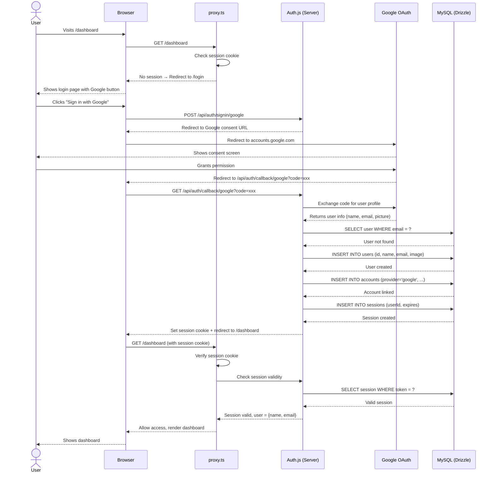

# Sequence Diagram: Auth Flow (Google OAuth)

## Notes

- Auth.js v5 handles the entire OAuth flow — no custom code needed beyond config
- The Drizzle adapter automatically manages users, accounts, and sessions tables
- `proxy.ts` runs on every request to protected routes, checking the session cookie
- Session expires after 30 days (configurable in Auth.js config)
- If session is invalid, user is silently redirected to login