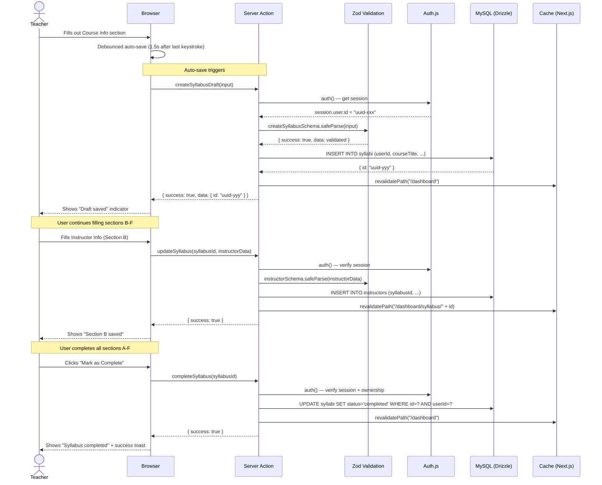

# Sequence Diagram: Create Syllabus

## Notes

- Each section saves independently via Server Actions
- Auto-save uses React's `useTransition` + debounce (1.5 seconds)
- Zod validation runs on **both** client (form) and server (Server Action)
- Every Server Action checks `auth()` before any DB operation
- `revalidatePath()` refreshes the dashboard list after changes
- The syllabus ID is created on first save (Section A), then reused for subsequent sections