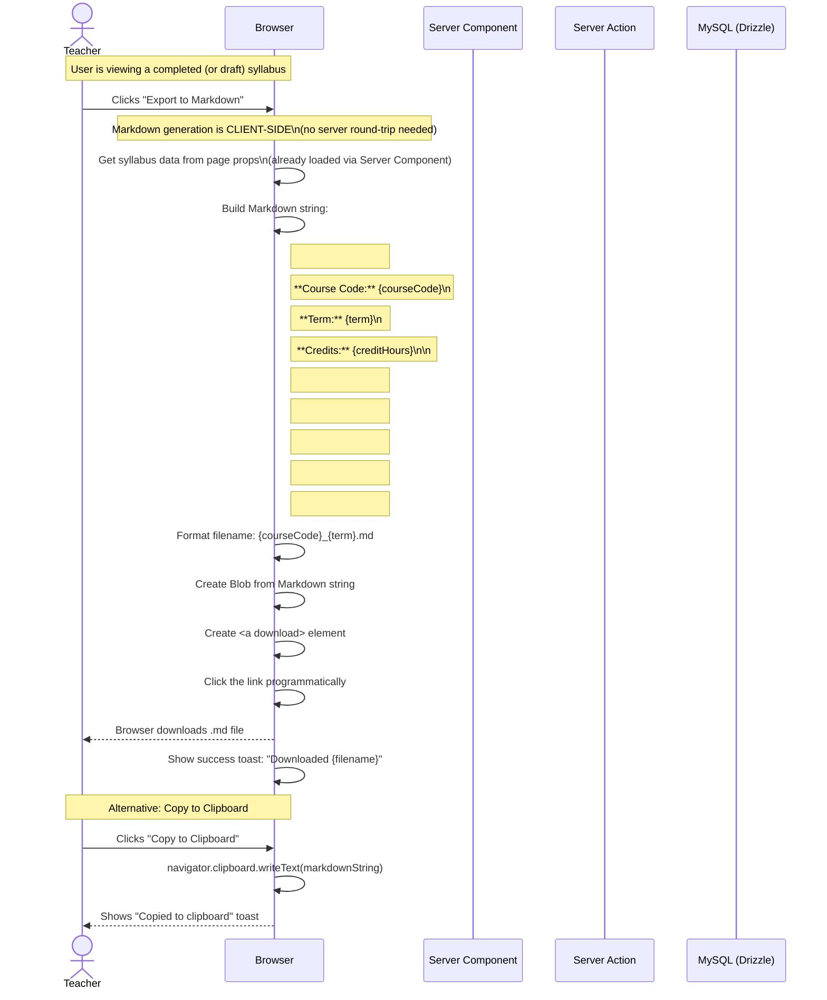

# Sequence Diagram: Export Syllabus to Markdown

## Notes

- Export is **entirely client-side** — no server call needed because the syllabus data is already loaded in the page (Server Component)
- The Markdown is generated from the in-memory syllabus object using a template function
- File download uses the Blob API + programmatic `<a>` click (works in all modern browsers)
- Clipboard copy uses `navigator.clipboard.writeText()` (requires HTTPS in production — Caddy provides this)
- If the syllabus has incomplete sections, they are included with a warning marker: `> ⚠️ Incomplete`
- The filename follows the pattern: `{courseCode}_{term}.md` (e.g., `IT601201_2567-1.md`)