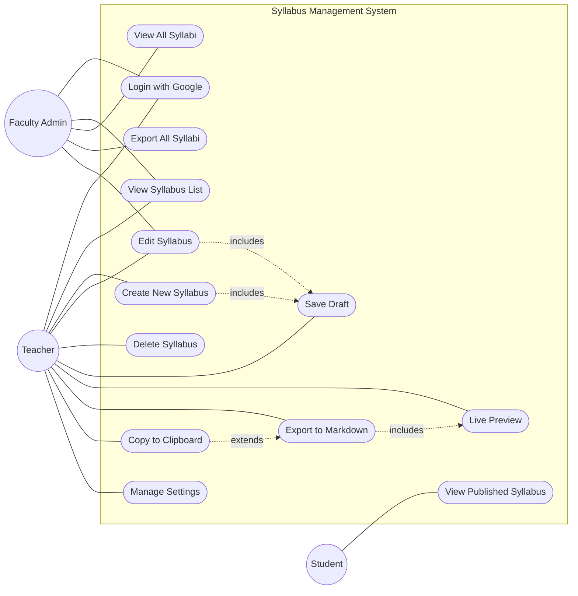

# Use Case Diagram

## Actor Descriptions

| Actor | Description | Authentication |
|-------|-------------|---------------|
| **Teacher** | Primary user. Creates and manages their own syllabi. | Google OAuth (faculty email) |
| **Faculty Admin** | Department administrator. Can view all teachers' syllabi and export them in bulk. | Google OAuth (admin email) |
| **Student** | End consumer. Views the exported/published syllabus. No login required if syllabus is published. | None (public link) |

## Use Case Descriptions

| Use Case | Description |
|----------|-------------|
| Login with Google | User signs in using their Google account (faculty email) |
| View Syllabus List | Teacher sees their own syllabi; Admin sees all syllabi |
| Create New Syllabus | Teacher fills out the มคอ.3 form (multi-section) |
| Edit Syllabus | Teacher modifies an existing syllabus |
| Delete Syllabus | Teacher removes a syllabus (soft delete) |
| Save Draft | Auto-saves or manual save while filling out the form |
| Live Preview | Side-by-side preview of how the Markdown will render |
| Export to Markdown | Downloads a .md file of the completed syllabus |
| Copy to Clipboard | Copies the raw Markdown text to clipboard |
| View All Syllabi | Admin views all teachers' syllabi across the department |
| Export All Syllabi | Admin exports all syllabi as a batch |
| View Published Syllabus | Student views the final published syllabus (read-only) |
| Manage Settings | User updates their profile and preferences |